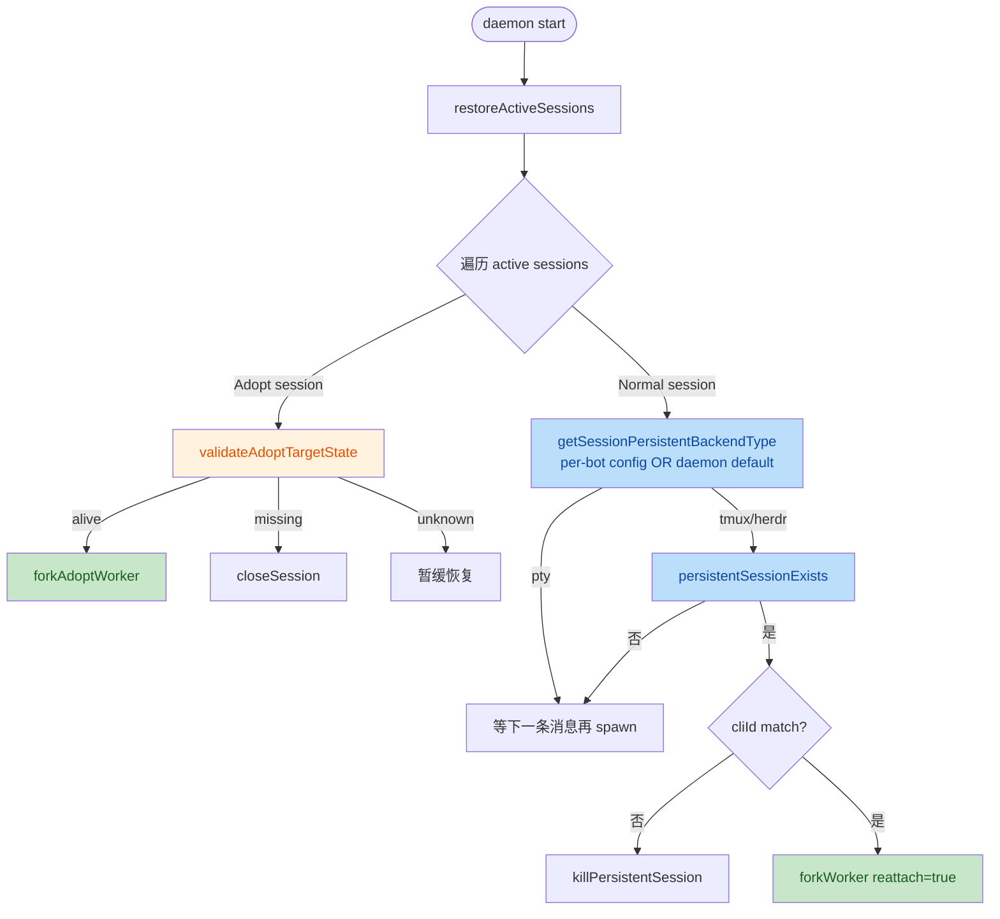
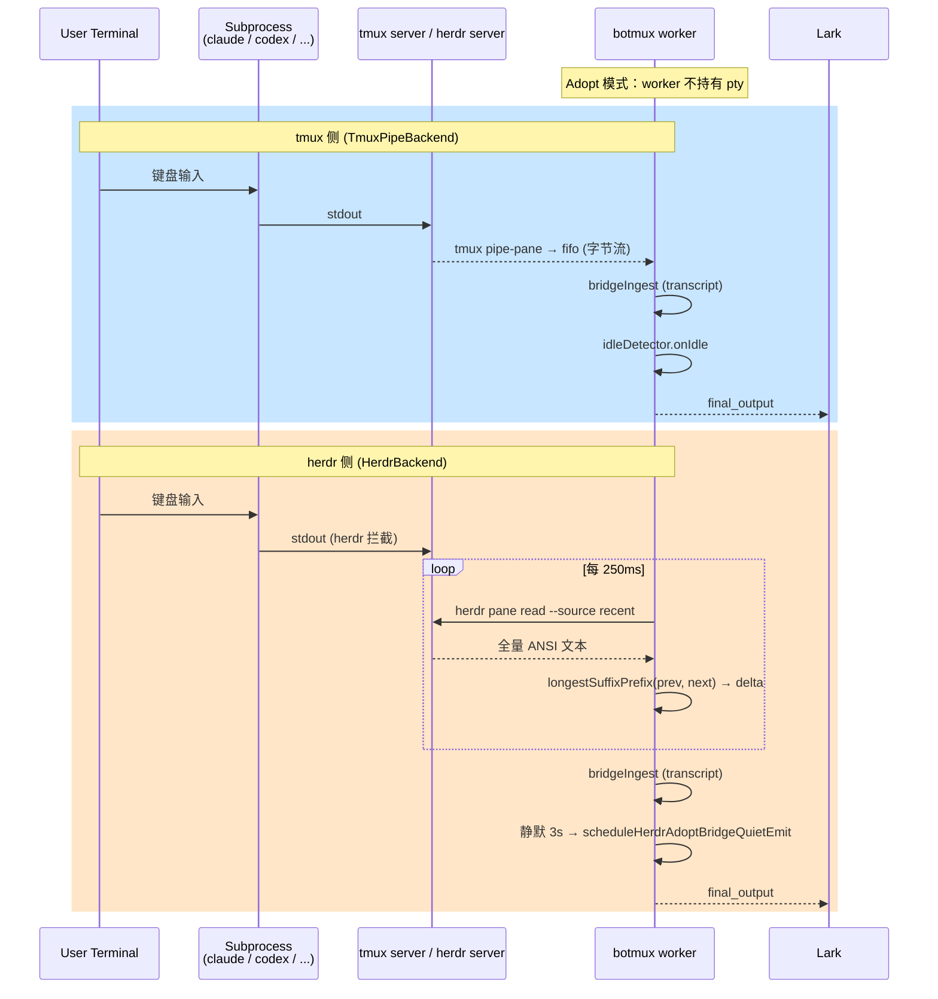

# Herdr ↔ Tmux Session Backend 架构对照

> Scope: PR #81 review 前置文档。目的不是描述 PR 改了什么，而是描述「herdr 后端如何沿用 tmux 既有的接入抽象」「哪些概念可以直接类比」「哪些需要为 herdr 单独建模」，作为后续 review 评判「是否合理复用 / 是否合理抽象」的尺子。

## 1. 抽象总览

botmux 的会话后端在 [types.ts](../../src/adapters/backend/types.ts) 处定义为统一接口 `SessionBackend`。截至本 PR，三种后端在抽象层级上是这样分布的：

```
                       SessionBackend (接口)
                        spawn / write / resize
                        onData / onExit / kill
              ┌──────────────┬──────────────┬───────────────┐
              ▼              ▼              ▼               ▼
         PtyBackend     TmuxBackend   TmuxPipeBackend   HerdrBackend
         (volatile)     (pty-under-   (pipe-pane,        (herdr CLI,
                         tmux,         no attach)        pane read 轮询)
                         attach 模式)
              └─────── 都是 SessionBackend，但只有右边 3 个属于 ───┘
                       「持久化后端」：进程生命周期 ≠ daemon

                       PersistentBackendType = 'tmux' | 'herdr'
```

关键性质：

| 维度 | pty | tmux (TmuxBackend / TmuxPipeBackend) | herdr (HerdrBackend) |
|---|---|---|---|
| 进程持久化 | 否（daemon 退出 → CLI 死） | 是（tmux server 持有 pane） | 是（herdr server 持有 agent） |
| Daemon 重启后 reattach | N/A | `tmux has-session` + attach/pipe | `herdr session list` + agent rebind |
| Adopt（外部进程接管） | N/A | pipe-pane 复刻字节流 | `herdr pane read --source recent` 轮询 |
| 写入路径 | pty.write | `tmux send-keys` / `paste-buffer` | `herdr pane send-text` / `send-keys` |
| 读取路径 | pty 'data' 事件 | mkfifo + pipe-pane 字节流 | 250ms 轮询 + 字符串 diff |
| 命名空间 | — | session = `bmx-<id8>` | session = `bmx-<id8>` |
| 寻址 | pty handle | tmux pane target `0:2.0` | herdr `pane_id` / `agent name` |

## 2. 概念对照表（herdr ↔ tmux）

这是本 PR review 的「类比基准」。每一行说明：tmux 侧某个既有概念，在 herdr 侧的等价物是什么；以及 PR 是否复用了同一抽象。

| 概念 | tmux 侧 | herdr 侧 | PR 中的表达 / 复用情况 |
|---|---|---|---|
| **持久会话命名** | `bmx-<sessionId.slice(0,8)>` | 同 | [TmuxBackend.sessionName](../../src/adapters/backend/tmux-backend.ts#L67-L70) ↔ [HerdrBackend.sessionName](../../src/adapters/backend/herdr-backend.ts#L110-L112)，命名规则与签名一致 ✅ |
| **静态生命周期 API** | `hasSession` / `killSession` / `listBotmuxSessions` | 同 | 形成事实上的「PersistentBackend 静态接口」，但**未提取成 TS interface**；多处用 `backendType === 'tmux' ? TmuxBackend : HerdrBackend` 二分支 ⚠️ |
| **可用性探测** | `TmuxBackend.isAvailable()` 走 `probeTmuxFunctional` | `HerdrBackend.isAvailable()` 走 `herdr --version` | 概念一致 ✅，但语义强度不同（tmux 是「能起 server」，herdr 只是「二进制存在」） |
| **后端选择入口** | `selectSessionBackend({ useTmux })` | `selectSessionBackend({ backendType })` | 入参从 boolean 改成 `BackendType`，是合理升级 ✅ |
| **管理模式 (botmux 自建会话)** | `TmuxBackend (createSession)` 或 `TmuxPipeBackend (createSession+ownsSession)` | `HerdrBackend (createSession)` | 复用了 `createSession` / `isReattach` 两个 flag 的命名习惯 ✅；但 herdr 的 `createSession` 字段实际未被 `spawn()` 消费（`ensureServer` 内部根据 `hasSession` 自决），是冗余/误导参数 ⚠️ |
| **Adopt 模式 (外部 session)** | `TmuxPipeBackend(paneTarget)`，paneTarget 是真实 pane 地址 `0:2.0` | `HerdrBackend(sessionName, { externalTarget })` | herdr 用对象 `HerdrExternalTarget` 而不是直接传 paneTarget 字符串 — 因 herdr 寻址需要 `(session, pane_id)` 两元组，**这个差异是合理的** ✅ |
| **Pipe 模式标志** | `isPipeMode = true`（pipe-pane 复刻，不 attach） | `isPipeMode = true`（pane read 轮询） | worker 把两者都标 `isPipeMode`，下游 transient-snapshot / web-terminal 路径**对待方式相同** ✅ |
| **Tmux 模式标志** | `isTmuxMode = true` 控制 idle / spawn / resize 走 tmux 分支 | `isTmuxMode = false`（herdr 不依赖 tmux idle 路径） | 合理：`isTmuxMode` 是 tmux-specific，不应污染 herdr 路径 ✅ |
| **当前屏幕/视口快照** | `TmuxPipeBackend.captureCurrentScreen / captureViewport` 走 `tmux capture-pane` | `HerdrBackend.captureCurrentScreen / captureViewport` 走 `herdr pane read --source recent / visible` | 通过把这三个方法**升格为 `SessionBackend` 可选成员** + transient-snapshot 改成鸭子类型 `SnapshotCapableBackend`，把 instanceof 依赖去掉了 ✅ 这是本 PR 最干净的一处抽象提升 |
| **Pane 尺寸** | `TmuxPipeBackend.getPaneSize()` 实时查询 tmux | `HerdrBackend.getPaneSize()` 返回 `resize()` 缓存的值 | herdr 没有「向 backend 查询真实尺寸」的能力（pane read 也没返回尺寸），只能靠本地缓存 — 这是 herdr 协议层限制，可以接受 ⚠️ 但 [discoverHerdrAdoptableSessions](../../src/core/session-discovery.ts#L297-L344) 处直接硬编码 `paneCols: 200, paneRows: 50` 是真假数据 ❌ |
| **Adopt validation** | `validateTmuxAdoptTarget(target, pid)` 走 pid tree 比对 | `validateHerdrAdoptTarget(sessionName, paneId)` 走 `agent list` 包含查 | `validateAdoptTargetState` 把两者收口到三态 `'alive' \| 'missing' \| 'unknown'`，**新增 unknown 是合理的**（herdr CLI 暂时报错时不应误关 session）✅ |
| **Bridge transcript（消息回灌）** | tmux adopt 走 `bridgeJsonlPath` (claude) / codex rollout / coco events / mtr sqlite | 同（herdr adopt 复用了同一套 transcript 路径） | 复用了 `setupAdoptTranscriptBridges` 抽出的 helper ✅；但 herdr 缺少 PTY idle 信号，PR 引入了 `HERDR_ADOPT_BRIDGE_QUIET_MS=3000` 静默触发器 — 这是 herdr-specific 必要补丁 ✅ |
| **Persistent backing-session 重建** | `restoreActiveSessions` 中 tmux 专属循环 + cliId-mismatch 守卫 | 同 | PR 把 tmux 专属循环抽象成 `getSessionPersistentBackendType / persistentSessionName / persistentSessionExists / killPersistentSession` 四个 helper，**循环本身只写一次** ✅；但四个 helper 都是 `if backendType === 'tmux' then Tmux else Herdr` 二分支，抽象层级**比真正的 strategy/registry 低一档** ⚠️ |
| **CLI ID 文件命名空间** | `last-cli-id` | `last-cli-id-herdr` | 隔离合理，避免 tmux/herdr 互相误清 ✅ |
| **destroySession vs kill** | `kill()` 仅断开 viewer，session 存活；`destroySession()` 才真杀 | 同语义；`HerdrBackend.kill()` 仅停轮询，`destroySession()` 调 `herdr session stop` | 语义对齐 ✅；但 `kill()` 漏杀已 spawn 的 detached `herdr server` 子进程，资源泄漏 ❌ |

## 3. 接入流程图（Mermaid）

### 3.1 Daemon 重启后的 backing-session reattach 流程



### 3.2 Adopt 模式：tmux pipe-pane vs herdr poll 的对照



## 4. 哪些抽象可以类比 / 哪些不能

### ✅ 应该（且 PR 已经）类比的

1. **静态会话命名**：`sessionName(sessionId)` → `bmx-<id8>` 一致。
2. **持久后端的生命周期 API 三件套**：`hasSession / killSession / listBotmuxSessions`。
3. **Snapshot capability**：`captureCurrentScreen / captureViewport / getPaneSize` 升格成 `SessionBackend` 可选方法 + 鸭子类型消费。
4. **Adopt validation 三态**：`alive / missing / unknown` 是对 backend 探测可靠性的**正确建模**——tmux 的 pid 探测几乎不会 unknown，但 herdr CLI 出错就是 unknown，需要区分对待。
5. **`isPipeMode` 标志**：把「不走 attach 的字节流式后端」抽象成一类，让 transient-snapshot / web-terminal 路径不必关心 tmux 还是 herdr。
6. **Adopt transcript bridge**：claude jsonl / codex rollout / coco events / mtr sqlite 这套流程**与底层后端正交**，PR 把它们抽出 `setupAdoptTranscriptBridges` 让 herdr 直接复用，路径完全正确。

### ⚠️ 应该类比但抽象不够彻底的

1. **PersistentBackend 静态接口**：tmux 和 herdr 都暴露 `sessionName / hasSession / killSession / listBotmuxSessions / isAvailable` 五个静态方法，签名完全一致。本 PR 在 [session-manager.ts](../../src/core/session-manager.ts) 和 [worker-pool.ts](../../src/core/worker-pool.ts) 用 `if (backendType === 'tmux') ... else ...` 二分支调度，本应抽成一个 registry：
    ```ts
    interface PersistentBackendOps {
      sessionName(id: string): string;
      hasSession(name: string): boolean;
      killSession(name: string): void;
      listBotmuxSessions(): string[];
    }
    const PERSISTENT_BACKENDS: Record<PersistentBackendType, PersistentBackendOps> = {
      tmux: TmuxBackend,
      herdr: HerdrBackend,
    };
    ```
    引入第三种 persistent backend 时再加二分支会指数级膨胀。
2. **PaneSize 真值来源**：tmux 通过 `display -p` 实时查询，herdr 协议层无此能力 → 但 [discoverHerdrAdoptableSessions](../../src/core/session-discovery.ts) 不应硬编码 200×50；应该至少从 worker 当前协商的尺寸传过来，或在 session 元数据里持久化。

### ❌ 不能直接类比、需要 herdr-specific 处理的

1. **Idle 信号**：tmux pipe 模式下 PTY 字节流 + idle detector 已经能识别 prompt；herdr 协议层提供了**真事件**——[`herdr wait agent-status <pane> --status idle/working/blocked/done`](https://herdr.dev/docs/cli-reference/#waits)，由官方集成（claude / codex / opencode 等）通过 `pane report-agent` 写入。这是优于 PTY idle detector 的能力，**不应**用 250ms 轮询 + 3 秒静默 hack 模拟。正确的接法：
    - 把 `wait agent-status --status idle` spawn 成阻塞子进程，事件到来 → `pane read` 拉增量 + 触发 transcript emit → 循环；
    - 与既有 `IdleDetector` 接口对齐，让 herdr 路径**复用** worker 的 idle/completion 流水线，而不是再造一套 `HERDR_ADOPT_BRIDGE_QUIET_MS=3000` 的伪事件；
    - 流式输出仍需 `pane read` 兜底（herdr 无 generic "output changed" 事件），但频率可从 4Hz 降到 0.5–1Hz。
2. **`getAttachInfo()`**：当前接口签名 `{ type: 'tmux'; sessionName: string } | null`，herdr 没有「attach」的概念（不存在 web terminal attach 路径），但**类型签名只允许 'tmux'**——herdr 强行 `return null` 在运行时是对的，但类型不闭合，应改成 `{ type: 'tmux' | 'herdr'; sessionName: string } | null` 或 `discriminated union`。
3. **`destroySession()` 必须杀 server**：tmux server 是用户终端共享的，botmux 不应杀；但 herdr server 是 botmux 自己用 `spawn(..., { detached: true })` 起的，daemon 退出/`kill()` 时如果不 wait/kill 这个子进程，就是 zombie/资源泄漏。

## 5. Review 判据

基于以上对照，本 PR 的 review 标准可量化为：

| 标准 | 检查点 |
|---|---|
| **复用 tmux 框架** | 持久后端调度循环、cleanupPersistentBackendSessions、setupAdoptTranscriptBridges 抽出 ✅；持久后端静态 API 二分支未抽 ⚠️ |
| **不影响原来逻辑** | tmux 路径需要保持原有语义；`backend?.destroySession?.()` → `backend?.kill()` 在 restart 处的语义漂移需要核查 ⚠️ |
| **类型明确** | `getAttachInfo` 类型只声明 tmux ❌；worker.ts 多处 `(backend as any)` ❌ |
| **扩展合理** | `BackendType` 三态 ✅；`AdoptableSession.source` 联合类型 ✅；`AdoptValidationResult` 三态 ✅ |
| **能复用尽量复用** | 静态 API 应抽 registry ⚠️；adopt bridge 已复用 ✅；snapshot 能力鸭子类型 ✅ |
| **合理抽象** | `SnapshotCapableBackend` 鸭子类型是好抽象 ✅；persistent backend ops 没抽到位 ⚠️ |
