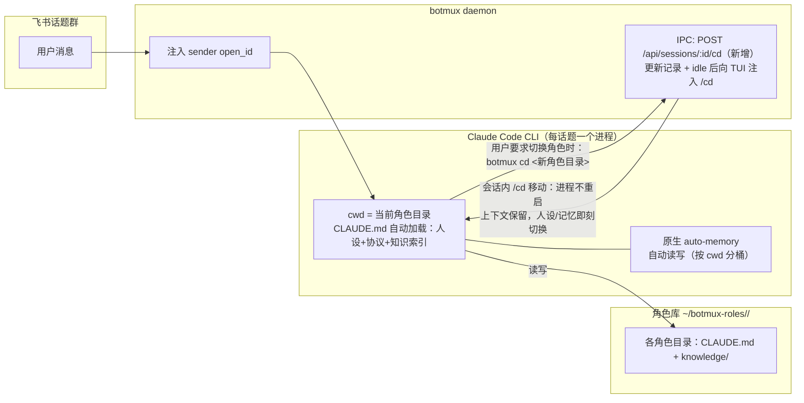
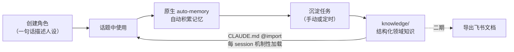

<!-- 评审真源：https://lmzqmchojc.feishu.cn/docx/ZIDgd5zwwoAQqaxNHHIcok0tn5d -->
<!-- 本文件为 v0.5 定稿快照（2026-07-11），后续修订以飞书文档为准 -->

<title>botmux 机器人角色系统设计方案：角色切换 + 记忆沉淀（方案 C）</title>

<callout emoji="📝">
状态：已定稿 · 2026-07-05 起草，2026-07-11 定稿 · 方案版本：v0.5
技术路线：**方案 C（角色 = 工作目录 + Claude Code 原生记忆）**，配套 botmux 代码改动约 300 行：botmux cd/botmux slash 两个命令与 brandLabel 变量替换（见 11.2/11.3）。较 v0.1 的变化：应评审意见从「纯 Skill 方案」切换到 C，原因见第 3 节。v0.3：实测 Claude Code 会话内 /cd（2.1.205）后，切换改为注入式——不重启进程、上下文保留，handoff 机制退役（见 7.1）。v0.4：角色脚注定案为 brandLabel 变量替换 + 通用目录元数据 .botmux-dir.json（与角色解耦）（{cwdName}/{cwdUrl}，见 7.4），§14 跳转目标问题随之关闭。v0.5：知识沉淀升级为「飞书文档审核界面 + 本地运行时真源」双层，pull→merge→push，用户修订可回流（见 §9）。
</callout>

# 1. 背景与目标

botmux 飞书机器人（底层 Claude Code）目前的 `/role` 机制只解决「人设注入」，记忆按 (bot, 工作目录) 分桶，与角色无关——同一个 bot 里所有角色共用一份记忆。本方案要达成：

- **方便切换角色**：非技术用户在飞书聊天里用自然语言完成切换，不依赖 slash 命令
- **角色独立记忆**：每个角色一份记忆，越用越懂对应领域
- **知识沉淀**：原始记忆可提炼为角色专属领域知识，回灌角色自身，并沉淀为飞书知识文档供人审核修订、修订可回流

# 2. 已确认的产品决策

| 决策点 | 结论 |
|-|-|
| 角色形态 | 同一个 bot 内切换；面向非技术用户，自然语言交互 |
| 底层 CLI | 只需支持 Claude Code |
| 角色归属 | 用户自建、私有：只能切换自己创建的角色；另有一个全员可用的默认角色 |
| 角色生效范围 | 按话题生效；新话题从默认角色开始 |
| 记忆作用域 | 角色全局共享：同一角色在所有群/话题的使用积累到同一份记忆 |
| 默认角色的记忆 | 全员共享一份（团队公共知识池） |
| 知识去向 | 飞书文档＝审核/编辑界面（一期落地），本地 knowledge/＝运行时真源；沉淀走 pull→merge→push，用户修订可回流 |
| 技术路线 | 方案 C：角色=工作目录，记忆走 Claude Code 原生 auto-memory（机制保证，不靠模型自觉） |
| botmux 改动范围 | 两处小改动：① 新增 `botmux cd` CLI 命令（cli.ts 一个 case + IPC 一条路由，与 botmux suspend/schedule 同构；daemon 在会话 idle 后向 TUI 注入会话内 /cd，**不重启进程、上下文保留**）；② `brandLabel` 支持 `{cwdName}`/`{cwdUrl}` 等变量替换，角色 bot 签名配成 `[{cwdName}](``{cwdUrl}``)` 即显示当前角色（见 7.4） |

# 3. 方案选型

考察过 4 条路线。v0.1 曾因「尽量少改 botmux」选了 D（纯 Skill 零代码）；评审中确认了两点后改选 **C**：一是 C 的记忆与人设加载全部是**机制保证**（原生 auto-memory 自动读写、CLAUDE.md 每 session 自动加载），不依赖模型自觉；二是 C 原本最大的短板「切换必须先做 daemon 卡片层」，可以用一个很小的 `botmux cd` CLI 命令消掉——CLI 里的 AI 自己调它完成切换，交互仍是纯自然语言。

| 路线 | 优点 | 结论 |
|-|-|-|
| A. botmux 自管记忆库 + prompt 注入 | 切换不重启 CLI；daemon 硬权限 | 代码量最大（存储、注入、卡片、蒸馏四块全新代码），落选 |
| B. 每角色独立 CLAUDE_CONFIG_DIR | 完整复用原生 auto-memory | ❌ 凭证按角色翻倍、sessions 分裂，落选 |
| ✅ C. 角色 = 工作目录（本方案） | 原生 memory 与 CLAUDE.md 全免费、机制硬；话题级 cwd 重钉是现成能力 | 入选。代价：角色改名会孤儿化记忆桶（「中途切换丢上下文」已被会话内 /cd 实测消除，见 7.1） |
| D. 纯 Skill + 文件约定 | 零 botmux 代码；中途切换不丢上下文 | 记忆读写靠 prompt 约定（模型可能忘记写/写串角色），机制软，落选 |

<callout emoji="💡">
关键事实（已核实代码）：① botmux 的 `/cd` 本来就是话题级重钉（command-handler.ts:1239）——只影响当前话题，正好等于「角色按话题生效」；② 原生 auto-memory 未被 botmux 禁用且已实际在用（隔离 bot 的记忆落在 `~/.botmux/bots/<appId>/claude/projects/<目录slug>/memory/`）；③ 每条消息 prompt 都带 `<sender open_id/>`，AI 可靠知道说话人是谁；④ `botmux schedule` 已示范「session 内 CLI 定位自己 → loopback HTTP 调 daemon」的完整样板，新命令照抄即可。
</callout>

# 4. 总体架构



角色的成长闭环：



# 5. 角色库目录结构

角色库就是文件系统，一个 bot 一棵树，**角色目录同时就是该角色的工作目录（cwd）**。目录名即角色名（支持中文）：

```text
~/botmux-roles/<bot名>/
  _role-protocol.md            ← 共享角色协议（单一来源，各角色 CLAUDE.md @import 引用）
  shared/
    默认助理/                   ← 默认角色：全员可用，记忆全员共享
      CLAUDE.md                ← 人设 + @import 协议 + @import 知识索引
      knowledge/
        INDEX.md               ← 领域知识索引
        <主题>.md               ← 沉淀后的领域知识文档
  users/
    <open_id>/                 ← 用户私有区，按飞书 open_id 归属
      产品经理/
        CLAUDE.md
        knowledge/ ...
      售后客服/ ...
```

<callout emoji="❗">
原始记忆**不在角色目录里**：它由 Claude Code 原生 auto-memory 自动维护，落在 bot 数据目录 `projects/<角色目录路径slug>/memory/`（隔离 bot 在 `~/.botmux/bots/<appId>/claude/` 下）。日常完全不用管；只有「角色改名/挪目录」会让记忆桶失联——见第 10 节风险与第 13 节改名工具。
</callout>

# 6. 协议分工：一切随 CLAUDE.md 机制性加载

不需要自定义 skill（避免 skill 按需匹配可能不命中的风险）。每个角色目录的 CLAUDE.md 由创建流程从模板生成，共两层：

| 文件 | 内容与职责 |
|-|-|
| `<角色目录>/CLAUDE.md`  <br/>（每 session 自动加载） | ① 本角色人设（定位/语气/专长/边界）；② `@import ../../_role-protocol.md` 共享协议；③ `@import knowledge/INDEX.md` 领域知识索引——三者每个新话题机制性进入上下文 |
| `_role-protocol.md`  <br/>（协议单一来源） | 角色系统的行为规则：如何列角色（按 sender open_id 扫 shared/ + users/<open_id>/）、如何切换（发确认消息 → 执行 `botmux cd <目标角色目录>`）、如何新建/删除角色（模板生成 CLAUDE.md，仅限操作自己 users/ 下的目录）、切换后先读新角色 memory/MEMORY.md、如何沉淀知识、权限规则 |

# 7. 交互流程（用户视角）

## 7.1 切换角色

> **用户**：切换角色
> 
> **机器人**：你当前的角色是「默认助理」。可切换到：  
> 1. 默认助理（团队共享）  
> 2. 产品经理 ⭐ 我的角色  
> 3. 售后客服 ⭐ 我的角色  
> 回复数字或角色名即可；说「新建角色：一句话描述」可创建新角色。
> 
> **用户**：2
> 
> **机器人**：✅ 已切换为「产品经理」，本话题内生效。发下一条消息即以新角色应答。

机制说明（v0.3 实测修订）：Claude Code 的会话内 `/cd` 命令（本机 2.1.205 实测）支持「移动会话到新工作目录」——进程不死、对话上下文保留、新目录 CLAUDE.md（人设+知识索引）即刻生效、记忆桶重锚、transcript 物理搬家。因此切换协议为两步：① 机器人发切换确认消息；② 执行 `botmux cd`——daemon 等本轮结束（复用 idle-detector）后向存活 CLI 的 TUI 注入 `/cd <新角色目录>`（复用 startupCommands 敲键机制），并同步更新 session 记录与落盘；CLI 不存活（如已挂起）时退化为只改记录、下条消息在新目录冷启动。协议需补的一行：切换完成后先读新角色的 memory/MEMORY.md（实测 /cd 不会自动注入已有记忆索引）。

<callout emoji="✅">
中途切换零损失（实测验证）：同一进程内完成切换，此前对话完整保留、新角色可直接引用；切换后的新记忆只写入新角色的桶，不会串。v0.2 曾设计的「交接摘要（handoff）」机制因此整体退役。
</callout>

## 7.2 新建角色

> **用户**：新建角色：小红书运营专家，熟悉我们美妆品牌的调性
> 
> **机器人**：我起草了「小红书运营专家」的人设：……（预览人设正文）确认创建吗？
> 
> **用户**：确认
> 
> **机器人**：✅ 已创建并切换。之后在任何话题说「切到小红书运营专家」即可使用。

## 7.3 沉淀知识

> **用户**：沉淀知识
> 
> **机器人**：正在整理「产品经理」的 23 条原始记忆……完成：合并进 3 个主题（需求评审规范 / 竞品结论 / 用户画像），新增 1 个主题（定价策略）。下次使用该角色自动生效。

## 7.4 角色标识脚注

bot 每条回复卡片左下角的 brand 位（现为蓝色「botmux」链接）改为显示**当前角色名**，点击跳转该角色的链接；非角色目录的会话不受影响（仍显示原 brand）。现状示意（图中蓝色「botmux」处即角色名渲染位）：


**实现**（第二处 botmux 小改动，与角色系统完全解耦的通用能力）：脚注「botmux」本就是 per-bot 可配置的 `brandLabel`（md-card.ts 的 `brandFooterSegment`，markdown 原生支持）。扩展其语义：签名串支持变量替换——`{cwdName}`（当前工作目录显示名：优先取目录下 `.botmux-dir.json` 的 name，缺省 basename）、`{cwd}`（完整路径）、`{cwdUrl}`（`.botmux-dir.json` 的 url，缺省为空）；替换后出现空链接 `[xxx]()` 自动降级为纯文本。仅当签名串含 `{` 时才走替换，静态签名与三态语义完全不变，存量 bot 零影响。分层：brandLabel 模板变量（通用）→ 目录元数据约定 `.botmux-dir.json`（通用，任何目录可放：repo 指项目主页、角色目录指知识文档）→ 角色系统只是该约定的使用者之一。接线两处：daemon 回复卡（worker-pool.ts 传 ds.workingDir）与 botmux send footer（cmdSend 已读 session，顺取 workingDir，无需新参数）；同步更新 dashboard 中 brandLabel 的帮助文案。

**角色 bot 的配置**：在 dashboard 把该 bot 的卡片签名设为 `[{cwdName}]({cwdUrl})`——角色目录名即角色名；角色目录的 `.botmux-dir.json` 配了 url 就是可点击链接，没配自动降级纯文本。首次沉淀创建知识飞书文档时自动回填该文件的 url——点角色名即可查看它沉淀的领域知识。后续可选增强（不进本期）：{cwdUrl} 为空且 cwd 为 git 仓库时回退推导 remote 网页地址，oncall bot 脚注自动链接到 repo。

## 7.5 七个典型使用场景（飞书视角）

下面按真实使用顺序展示用户在飞书里会遇到的七个场景。带示意图的场景配有飞书聊天样式的画板，直观呈现消息往来与卡片脚注变化。

### 场景一：开新话题直接聊（零学习成本）

用户什么都不用学：在话题群发起新话题直接提问，机器人以「默认助理」应答，卡片左下角脚注显示「默认助理」。角色系统对不需要它的用户完全透明。

### 场景二：切到自己的角色办事

新话题开头一句「切换角色」，机器人列出「默认 + 我自己的角色」，回复数字即切换——此后本话题由所选角色应答，脚注同步变为该角色名。场景二示意图：

<whiteboard token="HqR3wEGKthjatXb47jmcqumbnHh"></whiteboard>

<whiteboard token="PaW5wob3yhybgPbABfecrkkbnBc"></whiteboard>

### 场景三：聊一半请专家接班（上下文无缝延续）

话题聊到一半需要换专业角色时，直接说「切到XX」——同一进程内完成切换，此前对话完整保留，新角色接着上文继续，并已带上自己积累的记忆与领域知识。场景三示意图：

<whiteboard token="EDixwmChAh26PpbDjXkcrmMbnve"></whiteboard>

### 场景四：随口创建新角色

说「新建角色：一句话描述」，机器人起草人设给出预览，确认即创建并切换（完整对话见 7.2）。新角色归创建者私有，落在其 open_id 名下，其他用户看不到也切不到。

### 场景五：教它一次，处处记得（跨话题记忆）

在任何话题里纠正它、告诉它领域事实，原生记忆机制自动积累到该角色名下；之后在**另一个话题**（甚至另一个群）用同一角色时，它主动运用这些记忆。场景五示意图：

<whiteboard token="TDv9wCkHohm9MgbqedgcpxmTnYf"></whiteboard>

### 场景六：沉淀知识，越用越专业

对角色说「沉淀知识」，它把积累的原始记忆提炼成主题化的领域知识文档并汇报结果；此后每个新话题该角色自动带着这些知识开场。点击脚注上的角色名即可打开它的领域知识飞书文档——直接在文档里审核修订，说一句「同步知识」即拉回生效。场景六示意图：

<whiteboard token="PDfLwOL3khF1RLb1wiXcm3N5nof"></whiteboard>

<whiteboard token="BcmZwllOvhqNQYbIhdQc1OiTnTf"></whiteboard>

### 场景七：安全边界（越权与逃逸被拒）

用户 B 试图切换用户 A 的私有角色：角色列表根本不会展示 A 的角色；即使直接点名要切，协议按发送者 open_id 校验后拒绝。诱导机器人把话题切到角色库以外的目录，也会被 daemon 侧「必须位于角色库根之下」的硬校验拒绝。

# 8. 记忆积累（原生机制，零约定）

- Claude Code 原生 auto-memory 自动判断「值得长期记住的信息」并写入记忆目录、自动维护 MEMORY.md 索引、每个新 session 自动加载——**不需要教，不依赖模型遵守自定义约定**
- 记忆按 (bot 数据目录, cwd) 分桶：角色目录一分，「每角色独立记忆 + 同角色跨话题/跨群全局共享」自动成立
- 默认角色目录全员共用 → 默认角色记忆全员共享，自动成立
- 同一角色多话题并发 = 同一项目目录开多个 Claude Code 会话，原生机制本就支持

# 9. 知识沉淀协议

- **双层架构**：每角色一篇飞书文档「<角色名>·领域知识」＝**人的审核/编辑界面**（非技术用户唯一能触达的知识修订入口，团队可查阅）；本地 `knowledge/` + CLAUDE.md @import ＝**机器的运行时真源**（每 session 机制性注入，快、离线可用，不依赖 API）。文档 token/url 记在 `.botmux-dir.json`，首次沉淀创建文档时自动回填——脚注点角色名即达审核界面
- **沉淀流程（pull → merge → distill → push）**：先拉取飞书文档最新版（**吸收用户人工修订**，这是审核环节生效的机制）→ 与本地知识、新原始记忆三方合并蒸馏（模型做语义合并，优先级：用户人工修订默认保留、与新记忆冲突时在汇报中明示请裁决＞新记忆更新机器蒸馏的旧知识（变更列入汇报）；每次汇报「新增/修订/待裁决」清单，全程可审计。删除也是修订：用户从文档删掉的知识（文档没有、本地还有）同步删除本地，不被已归档记忆复活；仅当新记忆再次断言同一事实时作为冲突提请裁决。「沉淀→人审修订→再沉淀」构成可无限迭代的循环，每轮人工修订都是下一轮的基线）→ 写回本地 knowledge/ 并重建 INDEX.md → 推送飞书文档 → 记忆生命周期自动处置（三分类：已入知识→移 memory/archive/ 留审计与回滚依据；仍具记忆价值但不宜进共享知识→保留；过期噪音→清除；随手重建 MEMORY.md 使索引瘦身；archive 老化可由定期沉淀顺手打包，全程无需人工清理）→ 向用户汇报（附文档链接）。触发：用户说「沉淀知识」或 botmux-schedule 定期
- **用户修订回流**：用户在飞书文档里直接改，说一句「同步知识」即拉回本地生效；每次沉淀的 pull 步骤也会兜底吸收。同步语义＝最终一致：沉淀完成瞬间两边等价；之后正常漂移只有「文档新于本地」一个方向（本地 knowledge/ 仅由沉淀流程写入），任一收敛路径触发即对齐；「沉淀进行中用户同时改文档」的小竞态由 push 前再 diff 一次缓解。安全红利：知识回灌是持久改变角色行为的通道，人审一道岗顺便防「记忆投毒固化」
- **实现载体**：零 botmux 代码——bot 本身是飞书应用（自有 app 凭证，建文档配方已在本项目验证），pull/push 由 \_role-protocol.md 指挥模型用 lark 能力完成；知识文档保持简单 markdown 子集（标题/列表/段落/表格）保证 docx↔md 往返无损。二期增强：接入现有 `/subscribe-lark-doc` 订阅，文档变更自动同步，免说「同步知识」

# 10. 权限模型与风险

| 风险 | 说明 | 缓解 |
|-|-|-|
| 权限是软约束 | 「只能用自己的角色」由协议按 sender open_id 过滤，属 prompt 级约束，刻意诱导可能绕过 | 内部信任环境下可接受；v1 卡片层升级为 daemon 硬过滤（复用同一条 IPC cd 路由） |
| 切换的时机与注入 | 会话内 /cd 仅在 idle 时可执行；首次进入未信任目录会弹信任框；/cd 不自动注入新角色已有的 MEMORY.md | daemon 复用 idle-detector 排队注入；部署时把角色库根目录预置为受信目录（复用现有信任种子机制）；协议规定切换后先读新角色 memory/MEMORY.md |
| 角色改名/挪目录 | 记忆桶按目录路径 slug 分桶，改名后旧记忆失联 | v0 协议禁止改名（提示用户用「新建+沉淀迁移」替代）；后续出改名工具顺带搬记忆桶（第 13 节） |
| botmux cd 被滥用 | AI 可发起 cwd 重钉，被诱导可能钉到任意目录 | daemon 侧校验：**仅允许切到角色库根目录之下**；沿用 IPC 既有的签名鉴权头 |
| 发送者名字缺失 | open_id 必有，name 依赖通讯录权限 | 目录按 open_id 归属，名字仅用于展示 |
| 读隔离 bot | 角色库在 BOT_HOME 之外 | 读隔离只 deny 敏感路径，普通目录默认可读写；按验证清单实测 |

# 11. 部署清单

1. **botmux 代码**（两处小改动）：① `src/cli.ts` 加 `case 'cd'` + `cmdCd`（pid marker/env 自识别 session → findDaemon → POST），`src/core/dashboard-ipc-server.ts` 加 `POST /api/sessions/:sessionId/cd` 路由：校验目标在角色库根下 → 更新 session 记录落盘 → CLI 存活则等 idle 向 TUI 注入 `/cd <目录>`（抽为共享「idle 注入队列」模块并顺带暴露通用命令 botmux slash，见 11.1 分层），不存活则留待下条消息冷启动；② `brandLabel` 变量替换：渲染 helper 支持 `{cwdName}`/`{cwd}`/`{cwdUrl}` + 空链接降级，接入 worker-pool.ts 回复卡与 cli.ts botmux send footer，并更新 dashboard 帮助文案（见 7.4）
2. 创建 `~/botmux-roles/<bot>/` 骨架：\_role-protocol.md、默认角色目录（零人设起步：协议 @import + 一行中性描述）
3. bots.json：目标 bot 的 `defaultWorkingDir` 指向默认角色目录（新话题即默认角色，零代码）；确认该 bot 没有指向别处的 oncall 绑定；卡片签名（brandLabel）设为 {cwdName}
4. 确认 bot 具备飞书文档读写能力（lark-cli --as bot 或 app 凭证走 OpenAPI；隔离 bot 用自己的 send-cred 凭证），跑通「建文档→写入→分享给角色主人」一遍
5. 确认目标 bot 的 Claude Code 版本支持会话内 /cd（本机 2.1.205 实测通过）；把角色库根目录预置为受信目录（复用现有信任种子机制），避免注入 /cd 时弹信任框
6. 部署 build 到 live daemon：`pnpm switch:here && botmux restart`
7. 按第 12 节清单真机验证

## 11.1 botmux cd 命令规格

调用形式：`botmux cd <目标目录> [--silent] [--session <id>]`。与 botmux send/schedule 一样**自识别**所在会话，正常调用不需要 session/chat/bot 参数。

**分层：cd 是通用「TUI 注入」能力的特化**。实现时把「idle 注入队列」抽为 daemon 共享模块（复用 idle-detector + 各适配器现成敲键机制，统一 startupCommands / tui_keys / voice_summary 三个既有注入先例的归口），并顺带暴露通用命令 `botmux slash "<斜杠命令>"`：模型可请求向自己的 CLI 注入任意原生斜杠命令（自我 /compact、聊天中 /model 换模型等；v1 卡片层回调直接复用）。安全栏：仅限自己所在 session；只接受 `/` 开头的单行输入（防伪造用户消息自我循环）；bots.json 可选 allowlist 字段（如 tuiSlashAllow）门禁；/cd 固定排除在 slash 可注入范围之外（即使被加进 allowlist 也拒绝）——凡改变 daemon 记录所描述状态的命令必须走带同步逻辑的专用路由（botmux cd），防止事实源被绕过；**默认空=通用命令关闭**；复用 IPC 签名头。`botmux cd` 在此之上加三件特有的事：路径校验（角色库根）、session 记录同步落盘（唯一事实源）、CLI 不存活时冷启动兜底——所以 cd 不能退化为纯注入。通用层成本约 +50-80 行。读隔离兼容红线：allowlist 校验只在 daemon 侧（沙箱外）做；cmdCd/cmdSlash 客户端一律走 botmux send 同款自识别（env + 自己 BOT_HOME 的 send-cred + 自己的 sessions 文件），任何分支不得读 bots.json——规避仓库已知的「读隔离打断 CLI 子命令」坑。

| 参数 | 必填 | 说明 |
|-|-|-|
| `<目标目录>` | 是 | 角色目录绝对路径；daemon 侧 realpath 规范化后必须位于角色库根之下，否则拒绝 |
| `--silent` | 否 | 不发 daemon 的通用「已切换工作目录」话题消息（角色切换流程使用，因 AI 已先发角色化确认） |
| `--session <id>` | 否 | 显式指定 session，仅本机调试用 |

**客户端动作**（cli.ts `cmdCd`）：① pid marker（`.botmux-cli-pids/<pid>`）→ 回退 `BOTMUX_SESSION_ID` env，定位 sessionId/larkAppId（复用 `findAncestorSessionContext()`）；② 扫 dashboard-daemons 心跳文件 `findDaemon()` 拿 IPC 端口；③ 带 `X-Botmux-Cli-*` 签名头 POST `/api/sessions/:sessionId/cd`，body `{dir, silent}`；④ 打印结果（调用方进程随后被销毁属预期）。

**daemon 侧动作**（dashboard-ipc-server.ts 新路由）：① 校验签名 + session 归属；② 校验目录：realpath 防符号链接逃逸 → 必须在角色库根下 → 目录存在（复用 `validateWorkingDir`）；③ 更新 `ds.workingDir`/`ds.session.workingDir` 并落盘（复用从 /cd 抽出的共享函数）；④ 回 HTTP 响应；⑤ 按适配器能力位 supportsSessionCwdMove（本期预埋：claude-code 家族 true，其余 false）选择执行路径——支持且 CLI 存活 → 复用 idle-detector 等本轮结束后向 TUI 注入会话内 `/cd <目录>`（**进程不重启、上下文保留**，Claude Code 2.1.205 实测）；CLI 不存活或能力位为 false → 杀进程/等下条消息在新目录冷启动（通用兜底，覆盖全部 20+ CLI）。

**明确不做**：不改 bots.json/defaultWorkingDir/oncall（只改本话题 session 记录）；不碰角色文件与记忆文件；不能操作别的 session。**失败场景**：非 bot 会话内执行（无 marker/env）、daemon 不在线、目录在角色库外或不存在——均返回明确错误。**时序约束**：注入发生在会话 idle 之后，所以协议规定 botmux cd 是该轮最后一个动作（确认消息在其之前发出），本轮结束注入即生效。

## 11.2 改动规模与风险面评估

结论：两处增量改动（cd 的 idle 注入队列抽为共享模块，顺带暴露通用命令 botmux slash，见 11.1 分层），约 250–350 行，落在 4–5 个文件里，全部骑在现成模式上，对存量 bot 零行为变化。

| 改动 | 文件 | 规模 | 抄的现成样板 |
|-|-|-|-|
| ① botmux cd 命令 | `src/cli.ts`（case + cmdCd + help 一行） | \~60-80 行 | cmdSuspend / cmdResume 整段同构 |
| ① daemon 路由 | `src/core/dashboard-ipc-server.ts`（POST /api/sessions/:id/cd） | \~40-50 行 | suspend 路由 |
| ① 逻辑复用 | `src/core/command-handler.ts`（/cd 重钉逻辑抽成共享函数） | \~20 行搬家，非新增 | 生产在用的 /cd 本体 |
| ② 角色脚注 | 新 helper `resolveSessionBrandLabel(ds)` + `worker-pool.ts` 一处调用 + `cli.ts` send footer 一处 | \~40-60 行 | brandLabel / brandFooterSegment 机制 |

**风险面小的依据**（按仓库 CLAUDE.md 影响范围评估口径）：

- **不动公共路径核心**：不碰 worker spawn、adapter、session 生命周期、消息管线；重钉+杀进程复用 /cd 生产代码，只是多一个入口（IPC）和一道「必须在角色库根下」的收紧校验
- **跨 CLI**：botmux cd 对任何 CLI 的 session 都成立（只改 cwd 记录），不涉及 20+ 适配器的共用代码
- **跨会话类型/后端**：与 /cd 完全同路径，PTY/tmux、话题/群会话兼容性继承现状
- **对存量 bot 零影响**：脚注解析只在工作目录位于角色库根下时激活，其它会话走原逻辑分毫不变；botmux cd 不调用就不存在
- **无 schema 变更**：不改 bots.json 字段、不加依赖、不动数据格式

对照：角色系统的其余部分（角色库、人设、协议、记忆、沉淀）全是文件和配置，零代码；曾否决的方案 A 需要存储、注入、卡片、蒸馏四块新模块。二期卡片选择层是可选增量，不影响本期。

## 11.3 PR 拆分

| PR | 内容 | 独立价值 / 单独成 PR 的原因 | 依赖与规模 |
|-|-|-|-|
| PR1  <br/>feat(card) | brandLabel 变量替换：模板 helper + .botmux-dir.json + 空链接降级 + 两处接线 + dashboard 帮助文案 | 不等角色系统，oncall bot 即可用脚注显示 repo 名；含 { 才激活，存量零变化；附截图 | 无依赖，\~100 行 |
| PR2  <br/>feat(core) | TUI idle 注入队列 + botmux slash + tuiSlashAllow 门禁（默认关）+ /cd 固定排除 + 读隔离红线 | 自我 /compact、聊天换模型；唯一新机制，评审火力集中在队列时序；纯新增不动现有路径 | 无依赖，\~150-200 行 |
| PR3  <br/>feat(core) | botmux cd：/cd 重钉逻辑抽共享函数（含 resolvedPath 落盘修正）+ realpath/角色库根校验 + IPC 路由 + cmdCd + supportsSessionCwdMove 能力位 | 动了现有 /cd（全 CLI × 全会话类型共用路径），影响面评估与回归要求最高，必须独立评审 | 依赖 PR2，\~150-200 行 |
| PR4  <br/>docs(roles) | \_role-protocol.md 与 CLAUDE.md 模板、默认角色脚手架（可选 setup 脚本）、部署 runbook 与验证清单 | 零运行时代码；保证可复现 | 无依赖 |

合并节奏：PR1/PR2 并行；PR3 待 PR2 合入后 rebase。建角色树、bots.json 配置、信任预置、飞书凭证验证属上线 runbook（按 PR4 文档执行），不是 PR。每个 PR 按仓库规范附 pnpm build/test 与 switch:here 飞书实测记录。

# 12. 验证清单（飞书真机）

- [ ] 新话题不做任何操作，机器人以「默认助理」人设应答（CLAUDE.md 自动加载生效）

- [ ] 说「切换角色」，列表只含 shared + 我自己的角色（sender open_id 过滤）

- [ ] 回复数字/角色名：先收到确认消息，下一条消息起新人设生效

- [ ] 对角色说出一个领域事实，检查该角色的记忆桶（projects/<slug>/memory/）有新文件

- [ ] 另开新话题切到同一角色，能引用上一话题积累的记忆（跨话题共享）

- [ ] 「新建角色：xxx」全流程可用，目录落在自己的 users/<open_id>/ 下

- [ ] 「沉淀知识」后 knowledge/ 生成主题文档、INDEX 更新，新话题里角色能引用沉淀的知识

- [ ] 沉淀后：知识飞书文档已创建/更新且分享给角色主人；.botmux-dir.json 回填 url；脚注点角色名可打开文档；在文档中人工修订后说「同步知识」，新话题里修订生效

- [ ] 用另一个飞书账号尝试切换他人私有角色，被拒绝

- [ ] 诱导机器人 cd 到角色库外的目录，daemon 拒绝

- [ ] 中途切换角色：对话上下文保留（新角色能引用切换前的讨论）；切换后能引用新角色已有记忆（MEMORY.md 补读生效）

- [ ] 若 bot 开了读隔离：角色库与 .botmux-dir.json 读写正常、记忆桶正常；botmux cd / botmux slash 全链路可用（自识别→findDaemon→签名→POST，全程未触碰 bots.json）

- [ ] 回复卡片左下角显示当前角色名；配置了 .botmux-dir.json url 时点击跳转正确；切换角色后脚注随之变化；非角色目录会话仍显示原 brand

# 13. 后续演进（非本期）

- **v1 飞书卡片层**：daemon 加「角色」关键词触发 + 角色选择卡片，点击回调直接调本期新增的 IPC cd 路由；角色列表由 daemon 按 open_id 生成，权限升级为硬约束。存储与 v0 完全兼容，纯增量
- **多 CLI 支持（如 codex）**：C 骨架 CLI 无关（角色=目录、botmux cd、脚注、沉淀全通用），按 CLI 替换三支柱——人设文件（CLAUDE.md→AGENTS.md/GEMINI.md，脚手架多生成一份）、记忆分桶（codex 记忆是否按 cwd 分桶待验证，否则回退协议管理的角色内 memory/）、切换体验（无会话内 /cd 的 CLI 由能力位 supportsSessionCwdMove=false 自动走冷启动兜底，丢上下文但功能完整）。能力位已在本期预埋，故 codex/gemini 支持无需改 botmux 代码，只需脚手架模板（AGENTS.md/GEMINI.md）、协议文本与 bots.json 配置层面的兼容
- **知识文档变更自动同步**：接入现有 /subscribe-lark-doc 订阅机制，用户改完知识文档自动拉回，免说「同步知识」
- **角色改名工具**：改目录名 + 搬迁 projects/<slug>/ 记忆桶一步完成
- **沉淀增强**：蒸馏时扫描近期话题 transcript，补录对话中漏记的记忆

## 13.1 C→A 迁移路径（何时与如何）

若未来需要从方案 C（角色=工作目录+原生记忆）过渡到方案 A（botmux 自管记忆+prompt 注入），性质是「换引擎不换车身」：用户交互、角色资产、知识沉淀全部保留，用户无感；重写后端三块、报废两小块、一次性数据搬家。

| 类别 | 内容 |
|-|-|
| 保留不动 | 角色库目录树（shared/users 归属结构、knowledge/、.botmux-dir.json）直接作为 A 的 store 底座；用户交互与触发词 100% 不变；脚注机制只换数据来源（看绑定记录而非 workingDir）；v1 卡片层 UI 复用；沉淀流程仅改记忆路径 |
| 新写（\~1-2k 行） | ① prompt 注入层：消息包装加 <role>（人设+知识索引）与 <role-memory>（记忆索引+写入规则）块，含注入预算（有 /role 注入先例可扩展）；② 话题→角色绑定 store：切换=改绑定记录，不再杀进程，下条消息注入自然生效；③ 记忆读写协议：从原生 auto-memory 自动读写退回「注入指令+模型自觉」——**质量风险最大，回归重点是「该记的有没有记、会不会写串」**（当初选 C 正是为了这个机制保证） |
| 报废 | botmux cd 的角色用法（命令本身可留作通用能力）；（v0.3 起 handoff 已退役，无需处理） |
| 数据搬家（\~200 行脚本） | ① 记忆搬桶：projects/<角色目录slug>/memory/\* 搬进角色目录 memory/（slug↔目录可推导；隔离 bot 在 BOT_HOME、非隔离在 \~/.claude，两处都扫；§13 的「角色改名工具」即此脚本雏形）；② 人设转换：CLAUDE.md 剥掉 @import 协议行变 role.md；③ 存量话题可不迁（新话题走 A、老话题自然老化） |

**迁移触发条件**（痛点驱动，出现再动）：角色 bot 需要同时在代码仓库干活（cwd 不可被角色占用）；要支持 Codex/Gemini 等多 CLI；软权限不够用。均未出现时，停在 C 是健康终态——C 阶段的 .botmux-dir.json、目录归属结构、协议单源文件本就是给 A 预埋的兼容层。

# 14. 待你确认的问题

1. （部署时决定）部署到哪个 bot：不影响 spec 与各 PR 实现，属上线 runbook 第一步——届时确认该 bot 的 Claude Code 版本（≥会话内 /cd）、是否读隔离、defaultWorkingDir/oncall 现状
2. （已确认）默认角色零人设起步：CLAUDE.md 只含角色协议 + 一行中性描述，表现为通用助理；后续想加人设直接改文件，随时生效
3. （已定）触发词按第 6/7 节协议：「切换角色 / 切到XX / 新建角色：一句话描述 / 沉淀知识 / 同步知识」；语义等价的自然说法由模型识别，不做严格字面匹配
4. （已定）命令名：`botmux cd` 与 `botmux slash`
5. （已定）角色脚注跳转：brandLabel 配 `[{cwdName}]({cwdUrl})`，.botmux-dir.json 无 url 时自动降级纯文本；二期知识导出飞书文档后自动回填 url